## 🏧 Sistem Monitoring Cleaning Service ATM

<div align="center">


**Sistem manajemen dan monitoring untuk cleaning service ATM dengan fitur absensi, laporan pembersihan, dan manajemen inventory.**

[Demo](#-demo) • [Fitur](#-fitur-utama) • [Instalasi](#-instalasi) • [Dokumentasi](#-dokumentasi) • [Screenshots](#-screenshots)

</div>
---

## 📑 Daftar Isi

- [Tentang Proyek](#-tentang-proyek)
- [Fitur Utama](#-fitur-utama)
- [Demo](#-demo)
- [Teknologi](#-teknologi-yang-digunakan)
- [Persyaratan Sistem](#-persyaratan-sistem)
- [Instalasi](#-instalasi)
- [Konfigurasi](#-konfigurasi)
- [Database Schema](#-database-schema)
- [User Roles](#-user-roles--permissions)
- [Screenshots](#-screenshots)
- [Use Case Diagram](#-use-case-diagram)
- [Flowchart](#-flowchart)
- [API Documentation](#-api-documentation)
- [Testing](#-testing)
- [Deployment](#-deployment)
- [Troubleshooting](#-troubleshooting)
- [Contributing](#-contributing)
- [License](#-license)
- [Contact](#-contact)

---

## 🎯 Tentang Proyek

Sistem Monitoring Cleaning Service ATM adalah aplikasi web berbasis Laravel yang dirancang untuk mengelola dan memonitor aktivitas cleaning service yang bertugas membersihkan mesin ATM di berbagai lokasi.

### Problem yang Diselesaikan

- ❌ **Sebelum**: Sulit tracking kehadiran CS di lapangan
- ✅ **Sesudah**: Absensi real-time dengan foto & GPS timestamp

- ❌ **Sebelum**: Tidak ada bukti hasil pembersihan ATM
- ✅ **Sesudah**: Dokumentasi lengkap (before-after) untuk setiap ATM

- ❌ **Sebelum**: Manajemen inventory manual & tidak terdata
- ✅ **Sesudah**: Tracking stok otomatis dengan sistem approval

- ❌ **Sebelum**: Laporan harian dibuat manual di Excel
- ✅ **Sesudah**: Auto-generate laporan siap print

### Target Pengguna

- **Admin**: Pengelola sistem, manajemen master data
- **Koordinator**: Supervisor monitoring performa CS
- **Cleaning Service**: Petugas lapangan

---

## ✨ Fitur Utama

### 🔐 Authentication & Authorization
- [x] Multi-role login (Admin, Koordinator, CS)
- [x] Role-based access control (RBAC)
- [x] Session management
- [x] Password encryption

### 👥 Master Data Management (Admin)
- [x] **Kelola CS**: CRUD cleaning service dengan foto profil
- [x] **Kelola Area**: Manajemen area tugas (Jakarta Pusat, Selatan, dll)
- [x] **Kelola ATM**: Database mesin ATM dengan lokasi detail
- [x] **Assign CS ke Area**: Multi-assignment untuk fleksibilitas

### 📸 Absensi (CS)
- [x] Upload foto selfie saat absen
- [x] Pilih area tugas
- [x] Status: Hadir / Izin / Sakit
- [x] Validasi: 1x absen per hari
- [x] History absensi pribadi

### 📋 Laporan Pembersihan (CS)
- [x] Upload 3 foto per laporan:
  - Foto sebelum dibersihkan
  - Foto sesudah dibersihkan
  - Foto lokasi ATM
- [x] Catatan tambahan
- [x] Validasi: Harus absen dulu
- [x] Validasi: 1 ATM = 1 laporan per hari
- [x] History laporan pribadi

### 📦 Inventory Management (Admin)
- [x] CRUD alat & chemical
- [x] Tambah/kurangi stok manual
- [x] Tracking riwayat transaksi
- [x] Notifikasi stok rendah (<10)
- [x] Jenis item: Alat (pinjam) / Chemical (habis pakai)

### 🔄 Permintaan Inventory (CS → Admin)
- [x] CS ajukan permintaan alat/chemical
- [x] Jenis: Pinjam / Ambil
- [x] Admin approve/reject dengan keterangan
- [x] Auto-update stok saat approve
- [x] Riwayat permintaan

### 📊 Monitoring (Admin & Koordinator)
- [x] Dashboard statistik real-time
- [x] Monitoring absensi dengan filter (tanggal, CS, area, status)
- [x] Monitoring laporan dengan preview foto
- [x] Detail view dengan zoom foto
- [x] Export laporan harian (print-ready)

### 🖨️ Laporan Harian (Admin)
- [x] Generate laporan otomatis
- [x] Daftar absensi hari ini
- [x] Daftar laporan pembersihan
- [x] Format siap print/PDF
- [x] Tanda tangan koordinator

---

## 🎬 Demo

### Live Demo
**URL**: `https://demo-cleaning-service.example.com` *(if deployed)*

### Test Accounts

| Role | Email | Password |
|------|-------|----------|
| **Admin** | admin@cleaning.com | password |
| **Koordinator** | koordinator@cleaning.com | password |
| **CS #1** | andi@cleaning.com | password |
| **CS #2** | budi@cleaning.com | password |
| **CS #3** | citra@cleaning.com | password |

### Video Demo
[](https://youtube.com/your-demo-video)

---

## 🛠️ Teknologi yang Digunakan

### Backend
- **Framework**: [Laravel 12.x](https://laravel.com/)
- **Language**: PHP 8.2+
- **Database**: MySQL 8.0
- **ORM**: Eloquent
- **Authentication**: Laravel Breeze

### Frontend
- **Template Engine**: Blade
- **CSS Framework**: [Tailwind CSS 3.x](https://tailwindcss.com/)
- **JavaScript**: Vanilla JS
- **Icons**: [Heroicons](https://heroicons.com/)

### Tools & Libraries
- **Package Manager**: Composer, NPM
- **Asset Bundler**: Vite
- **Version Control**: Git
- **File Storage**: Local (Symlink)

---

## 💻 Persyaratan Sistem

### Minimum Requirements
```
PHP          >= 8.2
MySQL        >= 8.0
Composer     >= 2.0
Node.js      >= 18.x
NPM          >= 9.x
Apache/Nginx
```

### PHP Extensions Required
```
- OpenSSL
- PDO
- Mbstring
- Tokenizer
- XML
- Ctype
- JSON
- BCMath
- GD (for image processing)
- Fileinfo
```

### Server Configuration
```
Memory Limit     >= 256M
Upload Max Size  >= 10M
Post Max Size    >= 10M
Execution Time   >= 300s
```

---

## 🚀 Instalasi

### 1. Clone Repository

```bash
git clone https://github.com/username/cleaning-service-atm.git
cd cleaning-service-atm
```

### 2. Install Dependencies

```bash
# Install PHP dependencies
composer install

# Install Node dependencies
npm install
```

### 3. Environment Configuration

```bash
# Copy environment file
cp .env.example .env

# Generate application key
php artisan key:generate
```

### 4. Database Setup

Edit `.env` file:

```env
DB_CONNECTION=mysql
DB_HOST=127.0.0.1
DB_PORT=3306
DB_DATABASE=cleaning_service_atm
DB_USERNAME=root
DB_PASSWORD=
```

Create database:

```bash
mysql -u root -p
CREATE DATABASE cleaning_service_atm;
EXIT;
```

Run migrations:

```bash
php artisan migrate
```

### 5. Seed Database (Optional)

```bash
# Seed with sample data
php artisan db:seed

# Or seed specific seeder
php artisan db:seed --class=UserSeeder
php artisan db:seed --class=AreaSeeder
php artisan db:seed --class=AtmSeeder
php artisan db:seed --class=InventorySeeder
```

**Sample Data Included:**
- 1 Admin account
- 1 Koordinator account
- 3 CS accounts
- 3 Areas (Jakarta Pusat, Selatan, Utara)
- 6 ATMs
- 10 Inventory items

### 6. Storage Link

```bash
php artisan storage:link
```

### 7. Build Assets

```bash
# Development
npm run dev

# Production
npm run build
```

### 8. Start Development Server

```bash
php artisan serve
```

Access application: `http://127.0.0.1:8000`

---

## ⚙️ Konfigurasi

### File Upload Configuration

Edit `config/filesystems.php` if needed:

```php
'public' => [
    'driver' => 'local',
    'root' => storage_path('app/public'),
    'url' => env('APP_URL').'/storage',
    'visibility' => 'public',
],
```

### Upload Size Limits

Photo uploads (absensi & laporan): **5MB max**

Edit `php.ini` if needed:
```ini
upload_max_filesize = 10M
post_max_size = 10M
```

### Session Configuration

Edit `.env`:
```env
SESSION_DRIVER=file
SESSION_LIFETIME=120
```

### Timezone

Edit `config/app.php`:
```php
'timezone' => 'Asia/Jakarta',
```

---

## 🗄️ Database Schema

### ERD (Entity Relationship Diagram)


### Database Tables

| Table | Rows (Seeded) | Description |
|-------|---------------|-------------|
| users | 5 | Admin, Koordinator, 3 CS |
| cs_profiles | 3 | CS profile data |
| areas | 3 | Jakarta Pusat, Selatan, Utara |
| atms | 6 | 2 ATMs per area |
| area_cs_profile | 5 | CS-Area assignments |
| absensis | 0 | Daily attendance records |
| laporan_atms | 0 | Cleaning reports |
| inventories | 10 | Tools & chemicals |
| inventory_logs | 0 | Stock history |
| permintaan_inventories | 0 | Inventory requests |

---

## 👥 User Roles & Permissions

### Permission Matrix

| Feature | Admin | Koordinator | CS |
|---------|:-----:|:-----------:|:--:|
| **Dashboard** | ✅ Full Stats | ✅ Limited | ✅ Personal |
| **CRUD CS** | ✅ | ❌ | ❌ |
| **CRUD Area** | ✅ | ❌ | ❌ |
| **CRUD ATM** | ✅ | ❌ | ❌ |
| **CRUD Inventory** | ✅ | ❌ | ❌ |
| **View Absensi** | ✅ All | ✅ All | ✅ Own |
| **Create Absensi** | ❌ | ❌ | ✅ |
| **View Laporan** | ✅ All | ✅ All | ✅ Own |
| **Create Laporan** | ❌ | ❌ | ✅ |
| **View Permintaan** | ✅ All | ❌ | ✅ Own |
| **Create Permintaan** | ❌ | ❌ | ✅ |
| **Approve/Reject** | ✅ | ❌ | ❌ |
| **Print Laporan** | ✅ | ❌ | ❌ |
| **Manage Stock** | ✅ | ❌ | ❌ |

---

## 📸 Screenshots

### 1. Login Page

*Multi-role authentication dengan email & password*

### 2. Admin Dashboard

*Dashboard dengan statistik real-time dan quick actions*

### 3. Kelola CS

*CRUD cleaning service dengan foto profil dan area assignment*

### 4. CS Dashboard

*Dashboard CS dengan alert absensi dan quick actions*

### 5. Form Absensi

*Upload foto selfie dengan preview dan pilih area tugas*

### 6. Form Laporan ATM

*Upload 3 foto (before, after, location) dengan preview*

### 7. Monitoring Laporan

*Grid view laporan dengan preview foto dan filter*

### 8. Detail Laporan

*Detail lengkap dengan 3 foto full size dan modal zoom*

### 9. Kelola Inventory

*Manajemen inventory dengan notifikasi stok rendah*

### 10. Permintaan Inventory

*Workflow permintaan dengan status approval*

### 11. Print Laporan Harian

*Format print-ready untuk laporan harian*

> **Note**: Tambahkan screenshot asli di folder `docs/screenshots/`

---

## 📊 Use Case Diagram

```mermaid
graph TB
    Admin[👤 Admin]
    Koordinator[👤 Koordinator]
    CS[👤 Cleaning Service]

    Admin --> UC1[Kelola CS]
    Admin --> UC2[Kelola Area]
    Admin --> UC3[Kelola ATM]
    Admin --> UC4[Kelola Inventory]
    Admin --> UC5[Monitoring Absensi]
    Admin --> UC6[Monitoring Laporan]
    Admin --> UC7[Approve/Reject Permintaan]
    Admin --> UC8[Print Laporan Harian]
    Admin --> UC9[Tambah/Kurangi Stok]

    Koordinator --> UC5
    Koordinator --> UC6

    CS --> UC10[Absensi Harian]
    CS --> UC11[Buat Laporan ATM]
    CS --> UC12[Ajukan Permintaan Inventory]
    CS --> UC13[View Riwayat Absensi]
    CS --> UC14[View Riwayat Laporan]
    CS --> UC15[View Status Permintaan]

    UC10 --> UC11
    UC11 -.depends.-> UC10

    style Admin fill:#3B82F6,color:#fff
    style Koordinator fill:#10B981,color:#fff
    style CS fill:#F59E0B,color:#fff
```



---

## 🔄 Flowchart

### 1. CS Daily Workflow


### 2. Inventory Request Workflow

```mermaid
flowchart TD
    Start([CS Butuh Alat/Chemical]) --> Form[Form Permintaan]
    Form --> PilihItem[Pilih Item Inventory]
    PilihItem --> PilihJenis[Pilih Jenis:<br/>Pinjam/Ambil]
    PilihJenis --> IsiJumlah[Isi Jumlah]
    IsiJumlah --> IsiAlasan[Isi Alasan]
    IsiAlasan --> Submit[Submit Permintaan]

    Submit --> ValidasiForm{Validasi Form}
    ValidasiForm -->|Gagal| ErrorForm[Tampilkan Error]
    ErrorForm --> Form
    ValidasiForm -->|Berhasil| SavePending[(Simpan DB<br/>Status: PENDING)]

    SavePending --> NotifAdmin[📧 Notifikasi Admin]
    NotifAdmin --> AdminReview[Admin Review]
    AdminReview --> CheckStok{Stok Cukup?}

    CheckStok -->|Ya| KeputusanAdmin{Keputusan Admin}
    CheckStok -->|Tidak| Reject

    KeputusanAdmin -->|Approve| Approve[Approve Permintaan]
    KeputusanAdmin -->|Reject| Reject[Reject Permintaan]

    Approve --> KurangiStok[(Stok -= Jumlah)]
    KurangiStok --> BuatLog[(Buat Inventory Log)]
    BuatLog --> UpdateApprove[(Update Status:<br/>APPROVED)]
    UpdateApprove --> NotifCSApprove[📧 Notif CS: Disetujui]
    NotifCSApprove --> EndApprove([CS Ambil Barang])

    Reject --> IsiAlasanReject[Isi Alasan Penolakan]
    IsiAlasanReject --> UpdateReject[(Update Status:<br/>REJECTED)]
    UpdateReject --> NotifCSReject[📧 Notif CS: Ditolak]
    NotifCSReject --> EndReject([Selesai])

    style Start fill:#F59E0B,color:#fff
    style Approve fill:#10B981,color:#fff
    style Reject fill:#EF4444,color:#fff
    style EndApprove fill:#10B981,color:#fff
    style EndReject fill:#EF4444,color:#fff
```



### 3. Admin Monitoring Flow

```mermaid
flowchart TD
    Start([Admin Login]) --> Dashboard[Dashboard Overview]
    Dashboard --> Choice{Pilih Menu}

    Choice -->|Monitoring| Monitoring[Monitoring Laporan]
    Choice -->|Permintaan| Permintaan[Kelola Permintaan]
    Choice -->|Print| Print[Print Laporan Harian]

    Monitoring --> Filter[Filter:<br/>Tanggal/CS/Area]
    Filter --> ViewList[View List Laporan]
    ViewList --> ClickDetail[Klik Detail]
    ClickDetail --> ViewFoto[Lihat 3 Foto Full Size]
    ViewFoto --> ZoomFoto[Modal Zoom]
    ZoomFoto --> BackList[Kembali ke List]
    BackList --> Dashboard

    Permintaan --> FilterPermintaan[Filter: Status]
    FilterPermintaan --> ViewPermintaan[View List Permintaan]
    ViewPermintaan --> ClickPermintaan[Klik Detail]
    ClickPermintaan --> ReviewPermintaan{Review Permintaan}

    ReviewPermintaan -->|Approve| CheckStok{Stok Cukup?}
    ReviewPermintaan -->|Reject| InputReject[Input Alasan Reject]

    CheckStok -->|Ya| ProcessApprove[Process Approve:<br/>1. Kurangi Stok<br/>2. Buat Log<br/>3. Update Status]
    CheckStok -->|Tidak| ShowError[Error: Stok Habis]
    ShowError --> Dashboard

    ProcessApprove --> SuccessApprove[✅ Success Message]
    SuccessApprove --> Dashboard

    InputReject --> ProcessReject[Update Status: Rejected]
    ProcessReject --> SuccessReject[✅ Success Message]
    SuccessReject --> Dashboard

    Print --> SelectDate[Pilih Tanggal]
    SelectDate --> GenerateReport[Generate Report:<br/>1. Daftar Absensi<br/>2. Daftar Laporan]
    GenerateReport --> PreviewPrint[Preview Print]
    PreviewPrint --> PrintAction{Action}
    PrintAction -->|Print| DoPrint[🖨️ Print]
    PrintAction -->|PDF| SavePDF[💾 Save as PDF]
    DoPrint --> Dashboard
    SavePDF --> Dashboard

    style Start fill:#3B82F6,color:#fff
    style ProcessApprove fill:#10B981,color:#fff
    style ProcessReject fill:#EF4444,color:#fff
```



---

## 📡 API Documentation

### Authentication Endpoints

```http
POST /login
Content-Type: application/x-www-form-urlencoded

email=admin@cleaning.com
password=password

Response:
302 Redirect → /admin/dashboard (for admin)
               /koordinator/dashboard (for koordinator)
               /cs/dashboard (for cs)
```

```http
POST /logout

Response:
302 Redirect → /login
```

### Admin Endpoints

#### CS Management

```http
GET /admin/cs
Authorization: Required (Admin)

Response: HTML page with CS list
```

```http
POST /admin/cs
Authorization: Required (Admin)
Content-Type: multipart/form-data

name=John Doe
email=john@example.com
password=password
password_confirmation=password
no_hp=081234567890
tanggal_mulai_kerja=2024-01-01
areas[]=1
areas[]=2
foto=file

Response:
302 Redirect → /admin/cs (with success message)
```

```http
PUT /admin/cs/{id}
Authorization: Required (Admin)

Response:
302 Redirect → /admin/cs (with success message)
```

```http
DELETE /admin/cs/{id}
Authorization: Required (Admin)

Response:
302 Redirect → /admin/cs (with success/error message)
```

#### Inventory Management

```http
GET /admin/inventory
Authorization: Required (Admin)

Response: HTML page with inventory list
```

```http
POST /admin/inventory/{id}/tambah-stok
Authorization: Required (Admin)
Content-Type: application/x-www-form-urlencoded

jumlah=10
keterangan=Restocking

Response:
302 Redirect → /admin/inventory/{id} (with success message)
```

```http
POST /admin/permintaan/{id}/approve
Authorization: Required (Admin)
Content-Type: application/x-www-form-urlencoded

keterangan_admin=Approved

Response:
302 Redirect → /admin/permintaan (with success message)
Side Effect:
- Inventory stock decreased
- Inventory log created
- Status updated to 'approved'
```

### CS Endpoints

```http
POST /cs/absensi
Authorization: Required (CS)
Content-Type: multipart/form-data

area_id=1
status=hadir
foto_wajah=file
keterangan=On time

Response:
302 Redirect → /cs/absensi (with success message)
Validation:
- CS can only absen once per day
- area_id must be in CS's assigned areas
- foto_wajah max 5MB
```

```http
POST /cs/laporan
Authorization: Required (CS)
Content-Type: multipart/form-data

atm_id=1
foto_sebelum=file
foto_sesudah=file
foto_lokasi=file
catatan=Cleaned successfully

Response:
302 Redirect → /cs/laporan (with success message)
Validation:
- CS must have absensi for today
- atm_id must be in today's absensi area
- Each foto max 5MB
- One laporan per ATM per day
```

```http
POST /cs/permintaan
Authorization: Required (CS)
Content-Type: application/x-www-form-urlencoded

inventory_id=1
jenis_permintaan=pinjam
jumlah=2
alasan=Need for cleaning

Response:
302 Redirect → /cs/permintaan (with success message)
```

---

## 🧪 Testing

### Manual Testing

Login dengan akun test dan ikuti checklist:

#### As CS:
- [ ] Login berhasil
- [ ] Dashboard tampil dengan benar
- [ ] Bisa absen dengan upload foto
- [ ] Tidak bisa absen 2x di hari yang sama
- [ ] Bisa buat laporan setelah absen
- [ ] Upload 3 foto berhasil
- [ ] Tidak bisa laporan ATM di luar area absensi
- [ ] Bisa ajukan permintaan inventory
- [ ] Bisa lihat status permintaan
- [ ] Bisa lihat riwayat absensi & laporan sendiri
- [ ] Tidak bisa akses menu admin
- [ ] Logout berhasil

#### As Admin:
- [ ] Login berhasil
- [ ] Dashboard menampilkan statistik yang benar
- [ ] Bisa CRUD CS
- [ ] Bisa CRUD Area
- [ ] Bisa CRUD ATM
- [ ] Bisa CRUD Inventory
- [ ] Bisa tambah/kurangi stok manual
- [ ] Monitoring absensi tampil dengan benar
- [ ] Monitoring laporan tampil dengan filter
- [ ] Bisa lihat detail laporan dengan 3 foto
- [ ] Modal zoom foto berfungsi
- [ ] Bisa approve permintaan (stok berkurang)
- [ ] Bisa reject permintaan (stok tidak berubah)
- [ ] Print laporan harian berfungsi
- [ ] Notifikasi stok rendah muncul
- [ ] Logout berhasil

#### As Koordinator:
- [ ] Login berhasil
- [ ] Dashboard tampil
- [ ] Bisa monitoring absensi (read-only)
- [ ] Bisa monitoring laporan (read-only)
- [ ] Tidak bisa approve/reject permintaan
- [ ] Tidak bisa CRUD master data
- [ ] Logout berhasil

### Automated Testing (Optional)

```bash
# Run PHPUnit tests
php artisan test

# Run specific test
php artisan test --filter=AbsensiTest

# With coverage
php artisan test --coverage
```

---

## 🚀 Deployment

### Production Checklist

- [ ] Set `APP_ENV=production` di `.env`
- [ ] Set `APP_DEBUG=false` di `.env`
- [ ] Generate production key: `php artisan key:generate`
- [ ] Optimize configuration: `php artisan config:cache`
- [ ] Optimize routes: `php artisan route:cache`
- [ ] Optimize views: `php artisan view:cache`
- [ ] Build production assets: `npm run build`
- [ ] Set proper file permissions
- [ ] Configure SSL certificate
- [ ] Setup database backup
- [ ] Configure cron jobs (if any)

### Server Setup (Ubuntu/Nginx)

1. **Install Dependencies**
```bash
sudo apt update
sudo apt install nginx mysql-server php8.2-fpm php8.2-mysql php8.2-xml php8.2-mbstring php8.2-curl php8.2-zip php8.2-gd
```

2. **Configure Nginx**
```nginx
server {
    listen 80;
    server_name yourdomain.com;
    root /var/www/cleaning-service-atm/public;

    add_header X-Frame-Options "SAMEORIGIN";
    add_header X-Content-Type-Options "nosniff";

    index index.php;

    charset utf-8;

    location / {
        try_files $uri $uri/ /index.php?$query_string;
    }

    location = /favicon.ico { access_log off; log_not_found off; }
    location = /robots.txt  { access_log off; log_not_found off; }

    error_page 404 /index.php;

    location ~ \.php$ {
        fastcgi_pass unix:/var/run/php/php8.2-fpm.sock;
        fastcgi_param SCRIPT_FILENAME $realpath_root$fastcgi_script_name;
        include fastcgi_params;
    }

    location ~ /\.(?!well-known).* {
        deny all;
    }
}
```

3. **Set Permissions**
```bash
sudo chown -R www-data:www-data /var/www/cleaning-service-atm
sudo chmod -R 755 /var/www/cleaning-service-atm
sudo chmod -R 775 /var/www/cleaning-service-atm/storage
sudo chmod -R 775 /var/www/cleaning-service-atm/bootstrap/cache
```

4. **SSL Certificate (Let's Encrypt)**
```bash
sudo apt install certbot python3-certbot-nginx
sudo certbot --nginx -d yourdomain.com
```

### Environment Variables (Production)

```env
APP_NAME="Sistem Monitoring CS ATM"
APP_ENV=production
APP_KEY=base64:GENERATED_KEY
APP_DEBUG=false
APP_URL=https://yourdomain.com

DB_CONNECTION=mysql
DB_HOST=127.0.0.1
DB_PORT=3306
DB_DATABASE=cleaning_service_atm_prod
DB_USERNAME=db_user
DB_PASSWORD=strong_password

FILESYSTEM_DISK=public
SESSION_DRIVER=file
SESSION_LIFETIME=120

CACHE_DRIVER=file
QUEUE_CONNECTION=sync
```

---

## 🐛 Troubleshooting

### Common Issues

#### 1. Permission Denied Error

**Problem**: `The stream or file "storage/logs/laravel.log" could not be opened`

**Solution**:
```bash
sudo chmod -R 775 storage
sudo chmod -R 775 bootstrap/cache
sudo chown -R www-data:www-data storage bootstrap/cache
```

#### 2. 404 on All Routes (Except Homepage)

**Problem**: Nginx not configured properly

**Solution**: Enable rewrite rules in Nginx config (see deployment section)

#### 3. Image Upload Not Working

**Problem**: Storage link missing

**Solution**:
```bash
php artisan storage:link
```

#### 4. Database Connection Error

**Problem**: Wrong credentials or database doesn't exist

**Solution**:
```bash
# Check .env file
DB_CONNECTION=mysql
DB_HOST=127.0.0.1
DB_PORT=3306
DB_DATABASE=cleaning_service_atm
DB_USERNAME=root
DB_PASSWORD=

# Create database
mysql -u root -p
CREATE DATABASE cleaning_service_atm;
```

#### 5. Seeder Error: Class Not Found

**Problem**: Autoload not updated

**Solution**:
```bash
composer dump-autoload
php artisan db:seed
```

#### 6. Upload Max Filesize Error

**Problem**: PHP upload limits too small

**Solution**: Edit `php.ini`
```ini
upload_max_filesize = 10M
post_max_size = 10M
```

Then restart PHP-FPM:
```bash
sudo systemctl restart php8.2-fpm
```

### Debug Mode

Enable debug mode temporarily (NEVER in production):

```env
APP_DEBUG=true
```

Check logs:
```bash
tail -f storage/logs/laravel.log
```

---

## 🤝 Contributing

Contributions are welcome! Please follow these steps:

### 1. Fork the Repository

Click "Fork" button on GitHub

### 2. Clone Your Fork

```bash
git clone https://github.com/your-username/cleaning-service-atm.git
cd cleaning-service-atm
```

### 3. Create Feature Branch

```bash
git checkout -b feature/AmazingFeature
```

### 4. Make Changes

- Write clean, readable code
- Follow Laravel best practices
- Comment complex logic
- Update documentation if needed

### 5. Commit Changes

```bash
git add .
git commit -m "Add some AmazingFeature"
```

### 6. Push to Branch

```bash
git push origin feature/AmazingFeature
```

### 7. Open Pull Request

Go to GitHub and create a Pull Request with:
- Clear title
- Detailed description
- Screenshots (if UI changes)

### Code Style

- Follow PSR-12 coding standard
- Use meaningful variable names
- Keep functions small and focused
- Write self-documenting code

### Commit Message Format

```
type(scope): subject

body

footer
```

**Types**: feat, fix, docs, style, refactor, test, chore

**Example**:
```
feat(inventory): add low stock notification

Added email notification when inventory stock falls below 10 units.
Notification is sent to admin email address.

Closes #123
```

---

## 📄 License

This project is licensed under the **MIT License**.

```
MIT License

Copyright (c) 2024 Your Name

Permission is hereby granted, free of charge, to any person obtaining a copy
of this software and associated documentation files (the "Software"), to deal
in the Software without restriction, including without limitation the rights
to use, copy, modify, merge, publish, distribute, sublicense, and/or sell
copies of the Software, and to permit persons to whom the Software is
furnished to do so, subject to the following conditions:

The above copyright notice and this permission notice shall be included in all
copies or substantial portions of the Software.

THE SOFTWARE IS PROVIDED "AS IS", WITHOUT WARRANTY OF ANY KIND, EXPRESS OR
IMPLIED, INCLUDING BUT NOT LIMITED TO THE WARRANTIES OF MERCHANTABILITY,
FITNESS FOR A PARTICULAR PURPOSE AND NONINFRINGEMENT. IN NO EVENT SHALL THE
AUTHORS OR COPYRIGHT HOLDERS BE LIABLE FOR ANY CLAIM, DAMAGES OR OTHER
LIABILITY, WHETHER IN AN ACTION OF CONTRACT, TORT OR OTHERWISE, ARISING FROM,
OUT OF OR IN CONNECTION WITH THE SOFTWARE OR THE USE OR OTHER DEALINGS IN THE
SOFTWARE.
```

---

## 📞 Contact

**Developer**: Your Name

- 📧 Email: your.email@example.com
- 💼 LinkedIn: [linkedin.com/in/yourprofile](https://linkedin.com/in/yourprofile)
- 🐙 GitHub: [@yourusername](https://github.com/yourusername)
- 🌐 Website: [yourwebsite.com](https://yourwebsite.com)

**Project Link**: [https://github.com/yourusername/cleaning-service-atm](https://github.com/yourusername/cleaning-service-atm)

---

## 🙏 Acknowledgments

- [Laravel](https://laravel.com/) - The PHP framework
- [Tailwind CSS](https://tailwindcss.com/) - CSS framework
- [Heroicons](https://heroicons.com/) - Beautiful icons
- [Laravel Breeze](https://github.com/laravel/breeze) - Authentication scaffolding
- All contributors who helped make this project better

---

## 📚 Additional Resources

### Documentation
- [Laravel Documentation](https://laravel.com/docs)
- [Tailwind CSS Documentation](https://tailwindcss.com/docs)
- [MySQL Documentation](https://dev.mysql.com/doc/)

### Tutorials
- [Laravel Bootcamp](https://bootcamp.laravel.com/)
- [Laracasts](https://laracasts.com/)
- [Laravel Daily](https://laraveldaily.com/)

### Community
- [Laravel Forums](https://laravel.io/forum)
- [Laravel Discord](https://discord.gg/laravel)
- [Stack Overflow](https://stackoverflow.com/questions/tagged/laravel)

---

## 🔄 Changelog

### Version 1.0.0 (2024-02-08)
- ✨ Initial release
- ✅ Multi-role authentication
- ✅ CS management with photo upload
- ✅ Absensi with selfie photo
- ✅ Laporan with 3 photos (before, after, location)
- ✅ Inventory management
- ✅ Request approval workflow
- ✅ Monitoring dashboard
- ✅ Print daily report

---

<div align="center">

**⭐ If you find this project useful, please give it a star! ⭐**

Made with ❤️ using Laravel

---

**[Back to Top](#-sistem-monitoring-cleaning-service-atm)**

</div>
```

---

## 📁 STRUKTUR FOLDER TAMBAHAN UNTUK GITHUB

Buat folder dan file berikut untuk melengkapi dokumentasi:

### 1. Folder `docs/`

```bash
mkdir -p docs/screenshots
mkdir -p docs/diagrams
mkdir -p docs/api
```

### 2. File `CONTRIBUTING.md`

**Buat file: `CONTRIBUTING.md`**

```markdown
# Contributing to Sistem Monitoring Cleaning Service ATM

Thank you for considering contributing to this project!

## How to Contribute

1. Fork the repository
2. Create your feature branch (`git checkout -b feature/AmazingFeature`)
3. Commit your changes (`git commit -m 'Add some AmazingFeature'`)
4. Push to the branch (`git push origin feature/AmazingFeature`)
5. Open a Pull Request

## Code Style

- Follow PSR-12 coding standard
- Use meaningful variable names
- Write comments for complex logic
- Keep functions small and focused

## Testing

- Test your changes manually
- Ensure no breaking changes
- Update documentation if needed

## Pull Request Process

1. Update the README.md with details of changes if needed
2. Update the CHANGELOG.md with a note describing your changes
3. The PR will be merged once you have the approval of maintainers

## Code of Conduct

Please be respectful and constructive in all interactions.
```

### 3. File `CHANGELOG.md`

**Buat file: `CHANGELOG.md`**

```markdown
# Changelog

All notable changes to this project will be documented in this file.

## [1.0.0] - 2024-02-08

### Added
- Initial release
- Multi-role authentication system
- CS management module
- Area and ATM management
- Daily attendance (absensi) with photo upload
- ATM cleaning report with 3 photos
- Inventory management system
- Inventory request approval workflow
- Monitoring dashboard for Admin & Koordinator
- Print daily report feature
- Real-time statistics
- Low stock notifications

### Security
- Password encryption
- CSRF protection
- Role-based access control
- File upload validation
```

### 4. File `.github/ISSUE_TEMPLATE/bug_report.md`

```bash
mkdir -p .github/ISSUE_TEMPLATE
```

**Buat file: `.github/ISSUE_TEMPLATE/bug_report.md`**

```markdown
---
name: Bug report
about: Create a report to help us improve
title: '[BUG] '
labels: bug
assignees: ''
---

**Describe the bug**
A clear and concise description of what the bug is.

**To Reproduce**
Steps to reproduce the behavior:
1. Go to '...'
2. Click on '....'
3. Scroll down to '....'
4. See error

**Expected behavior**
A clear and concise description of what you expected to happen.

**Screenshots**
If applicable, add screenshots to help explain your problem.

**Environment:**
 - OS: [e.g. Ubuntu 22.04]
 - PHP Version: [e.g. 8.2]
 - Laravel Version: [e.g. 12.0]
 - Browser: [e.g. Chrome 120]

**Additional context**
Add any other context about the problem here.
```

### 5. File `.github/ISSUE_TEMPLATE/feature_request.md`

**Buat file: `.github/ISSUE_TEMPLATE/feature_request.md`**

```markdown
---
name: Feature request
about: Suggest an idea for this project
title: '[FEATURE] '
labels: enhancement
assignees: ''
---

**Is your feature request related to a problem? Please describe.**
A clear and concise description of what the problem is.

**Describe the solution you'd like**
A clear and concise description of what you want to happen.

**Describe alternatives you've considered**
A clear and concise description of any alternative solutions or features you've considered.

**Additional context**
Add any other context or screenshots about the feature request here.
```

---

## ✅ CHECKLIST SEBELUM PUSH KE GITHUB

- [ ] README.md sudah lengkap
- [ ] Screenshot sudah ditambahkan di `docs/screenshots/`
- [ ] CONTRIBUTING.md sudah dibuat
- [ ] CHANGELOG.md sudah dibuat
- [ ] LICENSE file sudah ada
- [ ] .gitignore sudah proper
- [ ] Tidak ada credential/password di code
- [ ] .env.example sudah ada dan lengkap
- [ ] Composer.lock di-commit
- [ ] Package-lock.json di-commit

---

**README.md ini sudah sangat lengkap dan profesional! Siap untuk di-push ke GitHub!** 🚀
